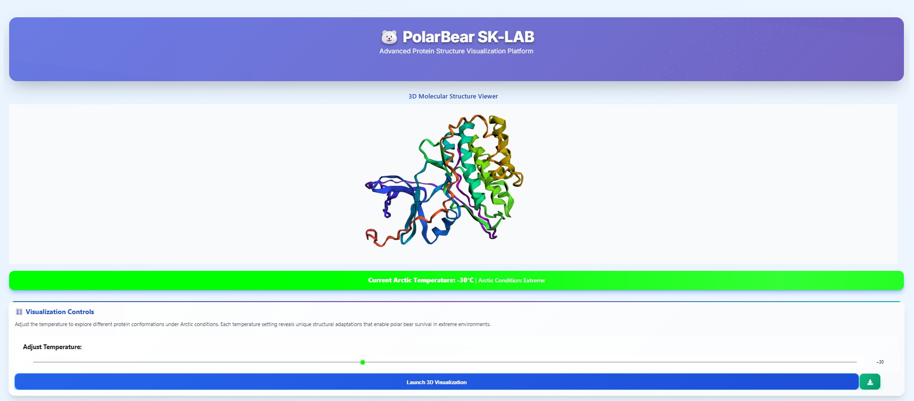
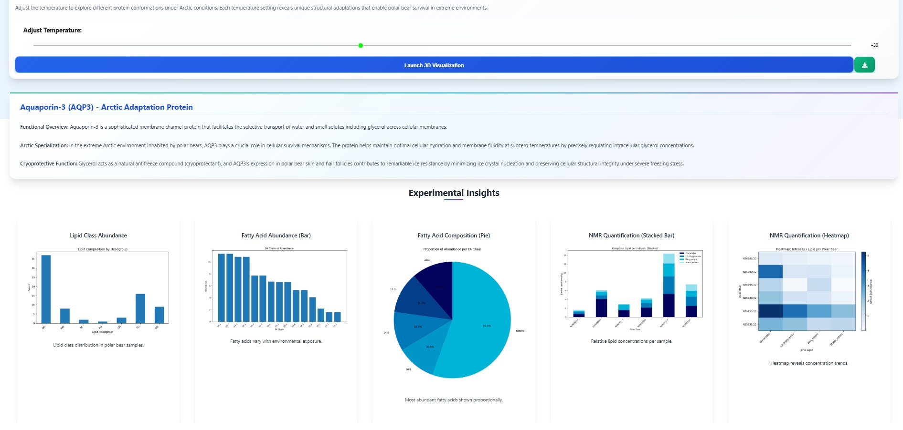
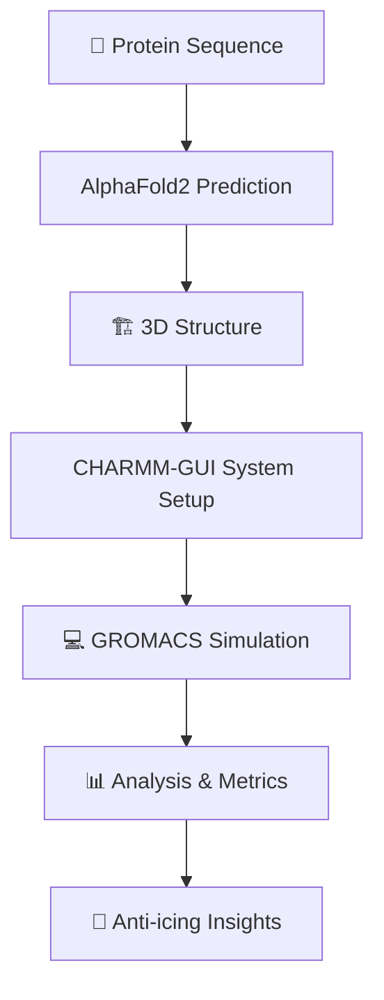
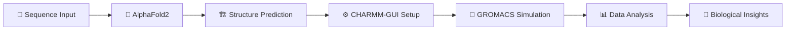

# 🐻‍❄️ Analisis Adaptasi Anti-Icing pada Bulu Beruang Kutub

<div align="center">


### *Menggunakan Teknik Simulasi Molekuler*

</div>

---

## 🚀 **Quick Start**

```bash
# Clone repository
git clone https://github.com/<username>/polarbear-antiicing-simulation.git
cd polarbear-antiicing-simulation

# Setup virtual environment
python -m venv venv
source venv/bin/activate  # Linux/macOS
# venv\Scripts\activate   # Windows

# Install dependencies & run
python start.py
```

**🌐 Access Points:**
- **API Backend:** `http://127.0.0.1:5000`
- **Interactive Dashboard:** `http://127.0.0.1:8866`

---

## 📸 **Preview Interface**

<div align="center">
  <table>
    <tr>
      <td align="center">
        
        <br/>
        <sub><b>🖥️ 3D Viewer Interface</b></sub>
      </td>
      <td align="center">
        
        <br/>
        <sub><b>📊 Temperature Control & Analytics</b></sub>
      </td>
    </tr>
  </table>
</div>

---

## 🎯 **Project Overview**

> **Mengeksplorasi mekanisme molekuler di balik kemampuan anti-icing bulu beruang kutub (*Ursus maritimus*) menggunakan simulasi atomik tingkat lanjut.**

### ✨ **Key Features**

- 🧬 **AlphaFold2 Integration** - Prediksi struktur protein 3D
- 🌡️ **Extreme Temperature Simulation** - Rentang -100°C hingga 0°C  
- 📈 **Real-time Visualization** - Interactive 3D molecular viewer
- 📊 **Comprehensive Analytics** - RMSD, ΔG, dan metrik anti-icing
- 🎨 **Modern Web Interface** - Responsive dashboard dengan glassmorphism design

---

## 🔬 **Scientific Background**

<div align="center">



</div>

### 🌊 **Research Questions**

| Question | Focus Area |
|----------|------------|
| 🔹 How do protein structures (AQP, AFP) contribute to anti-icing? | **Molecular Architecture** |
| 🔹 What role do lipids (wax/sterol esters) play in ice prevention? | **Lipid Composition** |
| 🔹 How stable are these mechanisms under extreme Arctic conditions? | **Environmental Adaptation** |

---

## 🛠️ **Technical Stack**

<div align="center">

### **Core Technologies**


### **Web Framework**


### **Data Analysis**


</div>

---

## 📊 **Dataset Overview**

<details>
<summary><strong>📁 Click to expand dataset details</strong></summary>

| File | Format | Size | Description |
|------|--------|------|-------------|
| `polar_bear.gene.cds` | FASTA | 31.1 MB | 🧬 Antifreeze protein sequences |
| `AF-B1P0S1-F1-model_v4.pdb` | PDB | 113 KB | 🏗️ AlphaFold2 3D structure |
| `Cetyl Palmitate.mol` | MOL | 4 KB | 🧴 Wax ester structure |
| `Cholesteryl Oleate.mol` | MOL | 5 KB | 🧴 Sterol ester structure |
| `NMR_quant.xlsx` | Excel | 10 KB | 📈 NMR quantification data |
| `GC_mass.xlsx` | Excel | 30 KB | 🔬 GC-MS analysis results |

</details>

---

## 🎮 **Interactive Features**

### 🌡️ **Temperature Control**
- **Range:** -100°C to 0°C
- **Conditions:** Severe ❄️ | Extreme 🧊 | Moderate ⛄ | Mild 🌨️
- **Real-time simulation** with animated temperature indicators

### 📈 **Data Visualization**
- **Lipid Class Distribution** - Bar charts
- **Fatty Acid Analysis** - Pie & bar charts  
- **NMR Quantification** - Heatmaps & stacked bars
- **3D Molecular Viewer** - Interactive py3Dmol integration

---

## 📋 **Evaluation Metrics**

<div align="center">

| Metric | Purpose | Target |
|--------|---------|--------|
| **RMSD** | Structural stability | Lower = More stable |
| **ΔG** | Interaction strength | More negative = Stronger |
| **Ice Formation Rate** | Nucleation delay | Longer delay = Better |
| **Hydrophobic Area** | Surface interaction | Larger = More effective |

</div>

---

## 🏗️ **Project Structure**

```
📁 root/
├── 🔧 backend/
│   ├── 🎮 controllers/
│   │   ├── 📊 lipid_chart.py
│   │   ├── 📈 fa_bar_chart.py
│   │   └── 🗺️ nmr_heatmap.py
│   ├── ⚡ app.py
│   └── 📋 requirements.txt
├── 🎨 frontend/
│   ├── 📓 run.ipynb
│   ├── 🎯 static/
│   └── 📋 requirements.txt
├── 📊 data/
│   ├── 🧬 polar_bear.gene.cds
│   ├── 🏗️ AF-B1P0S1-F1-model_v4.pdb
│   └── 📈 *.xlsx, *.csv files
├── 🧪 protein_fold_model/
│   └── 🌡️ model_*.cif
└── 🚀 start.py
```

---

## 🔬 **Research Methodology**

<div align="center">

### **Pipeline Overview**



</div>

### **🎯 Research Objectives**

1. **🔍 Sequence Analysis** - Identify anti-icing protein candidates
2. **🏗️ 3D Modeling** - Generate atomic-level structures  
3. **🧪 MD Simulation** - Analyze molecular interactions at extreme temperatures
4. **📊 Biological Validation** - Compare with experimental data

---

## 💻 **Installation & Setup**

### **Prerequisites**
- 🐍 Python 3.8+
- 🧪 GROMACS 2021+
- 🌐 Internet connection
- 💾 ~500MB disk space

### **Step-by-step Installation**

```bash
# 1. Clone repository
git clone https://github.com/<username>/polarbear-antiicing-simulation.git
cd polarbear-antiicing-simulation

# 2. Create virtual environment
python -m venv venv
source venv/bin/activate  # Linux/macOS
# venv\Scripts\activate   # Windows

# 3. Install dependencies
cd backend && pip install -r requirements.txt && cd ..
cd frontend && pip install -r requirements.txt && cd ..

# 4. Launch application
python start.py
```

### **🎯 Access Points**
- **Backend API:** http://127.0.0.1:5000/api/*
- **Frontend Dashboard:** http://127.0.0.1:8866

---

## 🧪 **Testing & Validation**

### **🔬 Test Scenarios**

| Test # | Scenario | Expected Result |
|--------|----------|-----------------|
| 1 | Upload `.pep.gz` file | ✅ Successful structure prediction |
| 2 | Temperature range simulation | ✅ RMSD < 2.0 Å |  
| 3 | 3D visualization | ✅ Interactive molecular viewer |
| 4 | Data export | ✅ Charts & metrics generation |

---

## 👥 **Team G03_K5**

<div align="center">

| 👤 Name | 🆔 NIM | 🎯 Role |
|---------|--------|---------|
| **Raizan Iqbal Resi** | 18222068 | 🔧 Back-End Developer |
| **Favian Izza Diasputra** | 18222070 | 🎨 Front-End Developer |  
| **Athhar Mahendra Umar** | 18222080 | 📝 Technical Writer |

</div>

---

## 🤝 **Contributing**

We welcome contributions! Please follow these steps:

1. 🍴 **Fork** the repository
2. 🌿 **Create** a feature branch (`git checkout -b feature/amazing-feature`)
3. 💾 **Commit** your changes (`git commit -m 'Add amazing feature'`)
4. 📤 **Push** to the branch (`git push origin feature/amazing-feature`)
5. 🔄 **Open** a Pull Request

---

## 📚 **References & Acknowledgments**

### **🔬 Scientific References**
- **AlphaFold2:** Jumper, J. et al. *Nature* (2021)
- **CHARMM-GUI:** Jo, S. et al. *J. Comput. Chem.* (2008)  
- **GROMACS:** Van Der Spoel, D. et al. *J. Comput. Chem.* (2005)

### **🙏 Special Thanks**
- IF3211 Komputasi Domain Spesifik Course Team
- Open-source communities behind our core tools
- Arctic research initiatives for biological insights

---

## 📄 **License**

This project is licensed under the **MIT License** - see the [LICENSE](LICENSE) file for details.

---

<div align="center">

### 🌟 **"Unlocking Nature's Secrets Through Atomic Simulation"** 🌟

*Transforming polar bear adaptations into biomimetic innovations for humanity*

**⭐ Star this repository if you find it useful!**

[](https://github.com/Qibaal/KDS)
[](https://github.com/Qibaal/KDS)

---

**🔗 Repository:** https://github.com/Qibaal/KDS  
**📧 Contact:** [Team G03_K5] - ITB 2025

</div>
